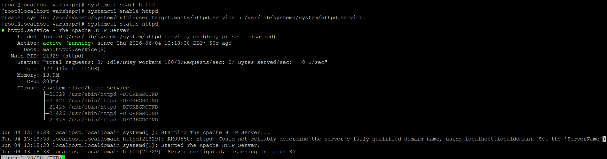
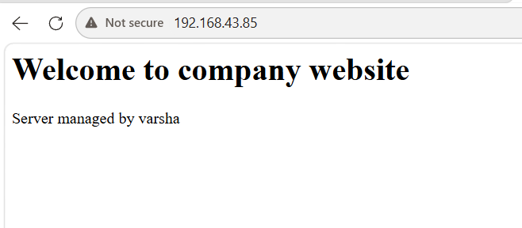
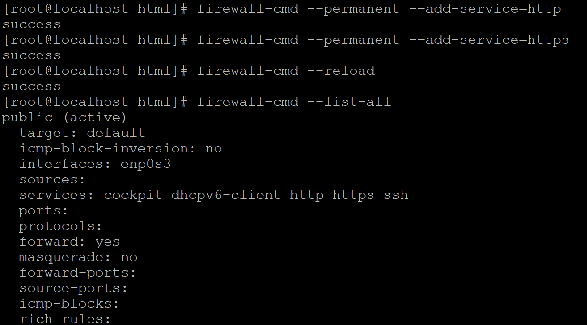
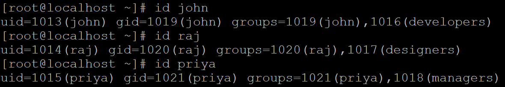
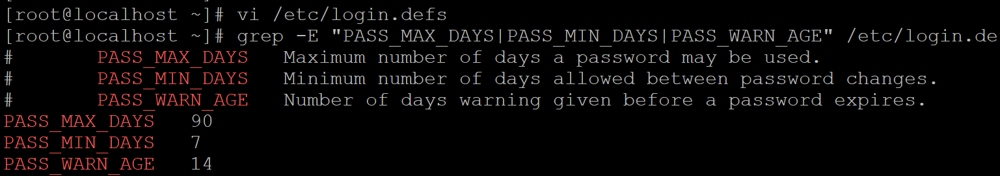
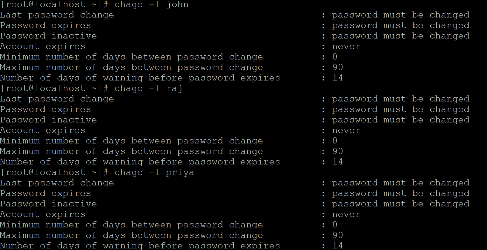

# Linux Web Server Setup & Security Hardening
**Platform:** CentOS Linux | **Tools:** Apache, firewalld, SSH, useradd, chage


## Project Scenario

A company required a secure and 
production-ready web server configured 
on CentOS Linux from scratch. As the 
Linux Administrator I was tasked with:

→ Deploying Apache web server to host 
  the company website

→ Configuring firewall to allow only 
  required web traffic

→ Creating department based users and 
  groups with proper file permissions
  so each team accesses only their data

→ Hardening SSH to prevent unauthorized 
  and brute force login attempts

→ Enforcing password expiry policies 
  across all user accounts

This project demonstrates real world 
Linux server administration skills 
that a junior Linux administrator 
performs during server provisioning 
and security hardening..

## What I Built

| Component | Details |
|---|---|
| Web Server | Apache on CentOS with virtual host |
| Firewall | firewalld — HTTP/HTTPS only |
| Users | 3 departments with role based access |
| SSH | Hardened with root login disabled |
| Password | 90 day expiry policy enforced |

## Tasks Completed

### Task 1 — Apache Web Server
- Installed Apache HTTP Server using yum
- Configured virtual host with custom document root
- Enabled service to start automatically on reboot

### Task 2 — Website Hosting
- Created website directory /var/www/mywebsite
- Configured virtual host in /etc/httpd/conf.d/
- Verified website accessible via browser

### Task 3 — Firewall Configuration
- Configured firewalld to allow HTTP and HTTPS
- Blocked all unnecessary ports
- Verified rules with firewall-cmd --list-all

### Task 4 — User & Group Management
- Created 3 department groups
  (developers, designers, managers)
- Created users and assigned to groups
- Created department folders with proper
  ownership and permissions (chmod 770)
- Verified access control working correctly

### Task 5 — SSH Hardening
- Disabled root login (PermitRootLogin no)
- Limited auth attempts (MaxAuthTries 3)
- Set login grace time (LoginGraceTime 60)
- Added warning banner for legal protection

### Task 6 — Password Policy
- Set 90 day password expiry (chage -M 90)
- Forced password change on first login
- Set 14 day warning before expiry
- Configured global policy in /etc/login.defs

## Commands Reference

### Apache
```bash
yum install httpd -y
systemctl start httpd
systemctl enable httpd
systemctl status httpd
```

### Firewall
```bash
firewall-cmd --permanent --add-service=http
firewall-cmd --permanent --add-service=https
firewall-cmd --reload
firewall-cmd --list-all
```

### Users and Groups
```bash
groupadd developers
useradd -m -G developers john
chown root:developers /shared/developers
chmod 770 /shared/developers
```

### SSH Hardening
```bash
# /etc/ssh/sshd_config changes
PermitRootLogin no
MaxAuthTries 3
LoginGraceTime 60
Banner /etc/ssh/banner.txt
```

### Password Policy
```bash
chage -M 90 username
chage -d 0 username
chage -W 14 username
```

## Security Improvements

| Setting | Before | After |
|---|---|---|
| Root SSH login | Allowed | Blocked |
| Auth attempts | 6 tries | 3 tries |
| Login time | 2 minutes | 60 seconds |
| Password expiry | Never | 90 days |
| Firewall | Open | HTTP/HTTPS only |


## Screenshots

### Apache Web Server Running


### Website Live in Browser


### Firewall Rules Configured


### Users and Groups Created


### SSH Hardening Applied


### Password Policy Set



## Tech Stack
- OS: CentOS Linux
- Web Server: Apache HTTP Server
- Firewall: firewalld
- Security: SSH hardening, chage
- Access Control: useradd, chmod, chown

## Author
Varsha P R
- LinkedIn: linkedin.com/in/varsha-p-r-843980360
- GitHub: github.com/varshapr-8
- Email: varshapbn8@gmail.com
